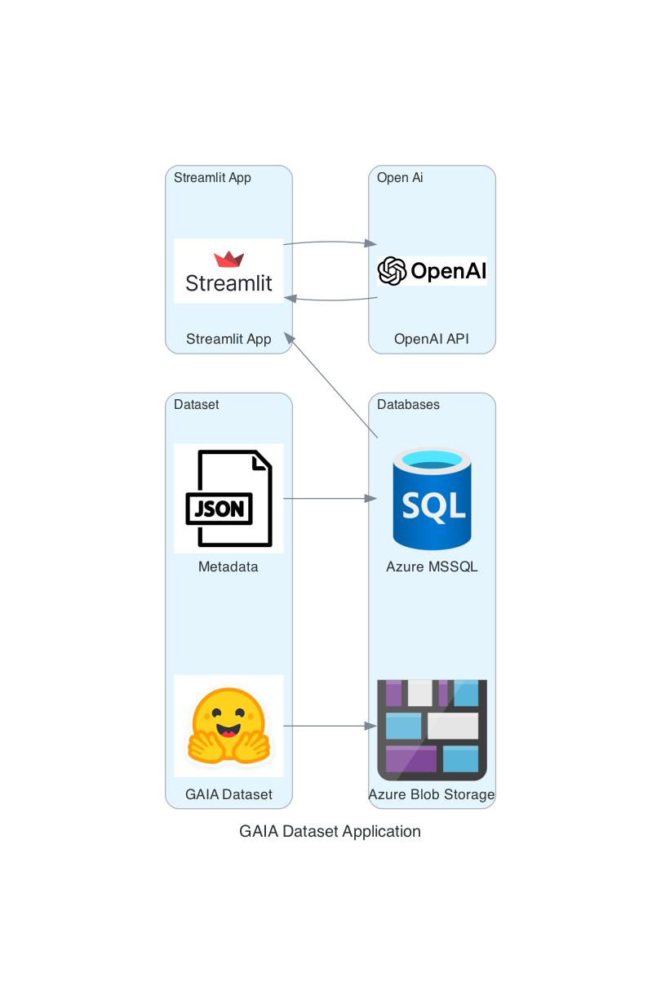

### Assignemnt1

The objective of this project is to enhance AI model performance analysis by developing a model evaluation tool with Streamlit. The application will enable users to select validation test cases from the GAIA dataset and evaluate responses from OpenAI models. By comparing the OpenAI-generated answers to pre-defined correct answers, users can compare the OpenAI manually if the answer is correct.

Key technologies involved include:
Streamlit: A framework for building interactive data applications. It serves as the user interface for selecting test cases, displaying outcomes, and capturing user feedback.

GAIA dataset: A dataset containing test cases, including questions and final answers, which serves as the foundation for model evaluation.

OpenAI models: To respond to the user-selected test cases, these language models will be queried to get a response 

Azure Cloud Storage: It stores additional files, such as spreadsheets, pdf, txt, etc that certain test cases refer to, while the file names are stored in the MySQL database.

MySQL: This database is used to store metadata, such as test case files and test case files.

## Project Resources

Google collab notebook: https://colab.research.google.com/drive/1-u0u6Ib5aPGprUhVwmp_Yj_Ie-FEaNgi?usp=sharing

Google codelab: [https://codelabs-preview.appspot.com/?file_id=1Ih2p01AQZP2_p7pM-CWIECQJQams-EnPEwdwYNav838#0](https://codelabs-preview.appspot.com/?file_id=18px-TAegVlOs1oNadKmOCIRENOkdTshtT2Newb_7Wvw#5)

App link (hosted on Streamlit Cloud): https://mainpy-heznqzbq2wxhheb66pts6x.streamlit.app/

Youtube Video URL: https://www.youtube.com/watch?v=hqx6lcAuugc

### Tech Stack
Python | Streamlit | OpenAI | Azure SQL | Azure Blob Storage

### Architecture diagram ###

### Project Flow

1) The application starts when a user selects a test case from the GAIA dataset via the frontend (Streamlit). The backend retrieves the metadata from a MySQL database and, if applicable, fetches external files stored in Azure Cloud Storage.

2) The backend prepares the test case and context, sending it to OpenAI through an API call. The OpenAI model generates a response, which is then compared to the final answer in the GAIA dataset. The results, along with the generated answer, are returned to the frontend for display.

3) User feedback and results are stored in the MySQL database. The frontend generates visualizations, such as pie charts, to show model performance across test cases, allowing users to view metrics like total attempts, correct answers, and evaluation summaries.

### Contributions

| Name                            | Contribution                                                                            |  
| ------------------------------- | ----------------------------------------------------------------------------------------|
| Sarthak Somvanshi                 | Text to speech Integration, Streamlit layout, Speech to Text Integration, Playlists     | 
| Yuga Kanse                   | Airflow, Pinecone Integration, Playlists , Azure Data Storage                           | 
| Tanvi Inchanalkar                     | JWT, Dockerization, GCP Deployment, FAST API                                            |                                                  

### Additional Notes
WE ATTEST THAT WE HAVEN’T USED ANY OTHER STUDENTS’ WORK IN OUR ASSIGNMENT AND ABIDE BY THE POLICIES LISTED IN THE STUDENT HANDBOOK. 
Contribution:
a. Sarthak Somvanshi: 33%
b. Yuga Kanse: 33%
c. Tanvi Inchanalkar: 33%

